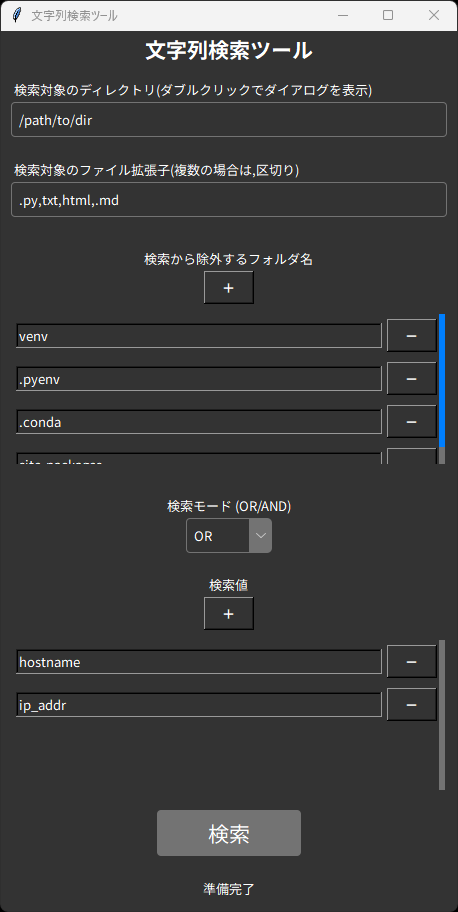

# TextHound
TextHoundは、指定されたフォルダ内のテキストファイルを検索し、特定のキーワードを含むファイルを見つける検索ツールです。

## 特徴

- GUIによる直感的な操作（Tkinter製）
- 指定フォルダ以下を再帰的に検索
- AND/OR 検索モード切り替え対応
- 検索対象ファイル拡張子を指定可能（例: `.py`, `.txt`）
- スレッドによる非同期検索（UIフリーズ防止）
- クロスプラットフォーム対応（Windows / Linux）
- 特定フォルダ（例: `.venv` や `.git`）を除外可能
- ヒットしたファイルのパスと、行番号付きの該当行を表示
- CUI での対話形式およびコマンドライン引数にも対応

## 使い方（CUI版）

### 1. 対話形式で実行

引数なしで実行すると、GUI ダイアログと CUI による入力で検索条件を指定できます。

```bash
python search_text_cui.py
```

* 検索フォルダ：GUIダイアログで選択
* 無視フォルダ：カンマ区切りで入力（例: `.git,__pycache__`）
* キーワード：カンマ区切り（例: `def,class`）
* 拡張子：カンマ区切り（例: `.py,.txt`）

---

### 2. コマンドライン引数で実行

```bash
python search_text_cui.py -t <検索フォルダ> -i <除外フォルダ> -k <キーワード> -e <拡張子> -m <モード>
```

#### 引数の説明

| オプション                 | 内容                                          |
| --------------------- | ------------------------------------------- |
| `-t`, `--target_dir`  | 検索対象のディレクトリ（必須）                             |
| `-i`, `--ignore_dirs` | 無視するディレクトリ（カンマ区切り、省略可）                      |
| `-k`, `--keywords`    | 検索キーワード（カンマ区切り、必須）                          |
| `-e`, `--exts`        | 検索対象のファイル拡張子（カンマ区切り、必須）                     |
| `-m`, `--mode`        | 検索モード：`or`（いずれかを含む）/ `and`（すべてを含む）省略時は `or` |

#### 実行例

```bash
python search_text_cui.py -t ./src -i .git,venv -k TODO,FIXME -e .py -m or
```

---

## 使い方（GUI版）
### 実行方法

```bash
python search_text.py
```

### スクリーンショット



---

## 出力例

```text
==================================================
./src/example.py
12: # TODO: この関数を修正する
35: # FIXME: 無限ループが発生する
```

## 注意点

* UTF-8 以外のエンコーディングのファイルはスキップされます。
* `UnicodeDecodeError` が発生した場合、自動的に無視されます。
* 日本語対応フォントがインストールされていない場合文字化けします。

## ライセンス

[MITライセンス](LICENSE.md)

#### 商用利用も歓迎いたしますが、事前にご連絡いただけると幸いです。

## 免責事項

1.  **無保証:** 本スクリプトは「現状有姿（as is）」で提供され、作者は、明示的か黙示的かを問わず、商品性、特定目的への適合性、権利の非侵害性その他一切の保証をいたしません。

2.  **責任の制限:** 作者は、本スクリプトの使用または使用不能から生じるいかなる損害（事業利益の損失、事業の中断、データの喪失、その他の金銭的損害を含むがこれらに限定されない）について、たとえ事前にその可能性について知らされていた場合でも、一切の責任を負いません。

3.  **自己責任:** 本スクリプトの導入および利用は、すべて利用者自身の責任において行ってください。

## Disclaimer

1.  **NO WARRANTY:** THIS SCRIPT IS PROVIDED "AS IS", WITHOUT WARRANTY OF ANY KIND, EXPRESS OR IMPLIED, INCLUDING BUT NOT LIMITED TO THE WARRANTIES OF MERCHANTABILITY, FITNESS FOR A PARTICULAR PURPOSE AND NONINFRINGEMENT.

2.  **LIMITATION OF LIABILITY:** IN NO EVENT SHALL THE AUTHORS OR COPYRIGHT HOLDERS BE LIABLE FOR ANY CLAIM, DAMAGES OR OTHER LIABILITY, WHETHER IN AN ACTION OF CONTRACT, TORT OR OTHERWISE, ARISING FROM, OUT OF OR IN CONNECTION WITH THE SCRIPT OR THE USE OR OTHER DEALINGS IN THE SCRIPT.

3.  **OWN RISK:** The installation and use of this script is at your own risk.